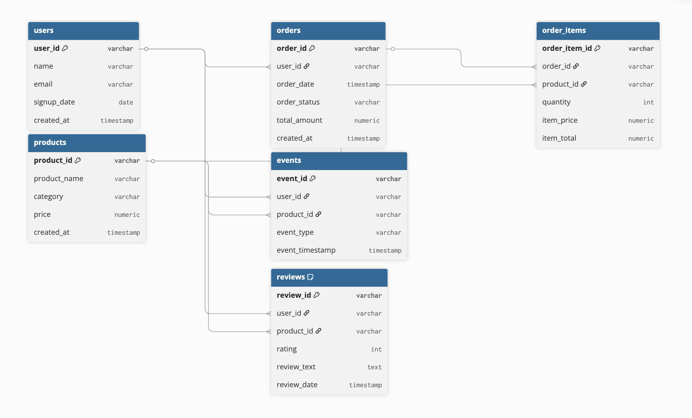

# E-commerce SQL Analytics Project

## Project Overview
This project analyzes a multi-table e-commerce dataset using PostgreSQL to uncover key insights into revenue performance, customer behavior, and product trends.
The analysis simulates real-world business analytics workflows including data validation, revenue analysis, customer segmentation, and product performance evaluation.
Key findings from the analysis reveal revenue concentration among top customers, strong contribution from repeat buyers, and category-level sales variation that can inform strategic decision-making.

---

## Project Objectives
- Analyze overall revenue performance and growth trends
- Identify high-value customers and purchasing behavior patterns
- Evaluate product and category-level sales performance
- Measure revenue concentration across customer segments
- Perform structured data validation to ensure data integrity
- Simulate real-world business analytics using SQL
  
---

## Tools & Technologies
- PostgreSQL
- pgAdmin
- SQL
- Kaggle E-commerce Dataset
- GitHub

---

## Dataset Overview
The dataset consists of six interconnected tables representing a modern e-commerce platform:

- **users** – customer demographics and signup details  
- **products** – product catalog and pricing  
- **orders** – order-level transactions  
- **order_items** – product-level order details  
- **reviews** – customer ratings and feedback  
- **events** – user interaction events (views, cart, wishlist)

All tables are connected using primary and foreign key relationships to maintain referential integrity.

> For detailed column-level documentation, refer to dataset/README.md

---

## Entity Relationship Diagram (ERD)

The following diagram illustrates the relational structure of the e-commerce database, including primary and foreign key relationships.

> 

---
## Business Questions & Analytical Scope

- This project answers key strategic business questions across revenue, customers, and product performance.

> For the complete list of documented business questions, refer to: analysis/business_questions.md

---

## Key Insights
- **Total Revenue from completed orders:** $2,419,712.58
- **Revenue Trend & Seasonality:** Monthly revenue shows moderate fluctuations, with noticeable spikes in March 2024 and May–June 2025, indicating mild seasonality rather than strong Q4 dependency. Revenue stabilizes above $100K in most 2025 months, suggesting improving consistency.
- **Revenue Concentration:** The top 10% of customers generate 39.22% of total revenue, demonstrating moderate revenue concentration among high-value customers.
- **Customer Retention Impact:** Repeat customers contribute 32.05% of total revenue. While repeat buyers play a meaningful role, revenue still relies significantly on first-time purchasers, highlighting opportunities to strengthen retention strategies.
- **Average Order Value (AOV):** $601.77, indicating relatively high per-transaction spending.
- **Top-Performing Category:** Electronics, contributing the largest share of total revenue and acting as the primary revenue driver.
- **Strategic Insight:** Revenue is partially concentrated among a small segment of high-value customers, suggesting the business would benefit from targeted loyalty programs, personalized marketing, and retention initiatives to maximize lifetime value and reduce dependency risk.

---

## Advanced Analysis Implemented
- Revenue concentration (Pareto analysis – Top 10% customers)
- Customer classification (one-time vs repeat buyers)
- Monthly revenue and order trend analysis
- Data quality validation checks

---

## Project Structure
- **dataset/** – Raw CSV data files  
- **schema/** – Database schema and ERD  
- **analysis/** – SQL scripts for validation and business analysis  
- **README.md** – Project documentation  

---

## Project Status
This project is currently **in progress**.  
Additional advanced customer and behavioral analytics will be added.
